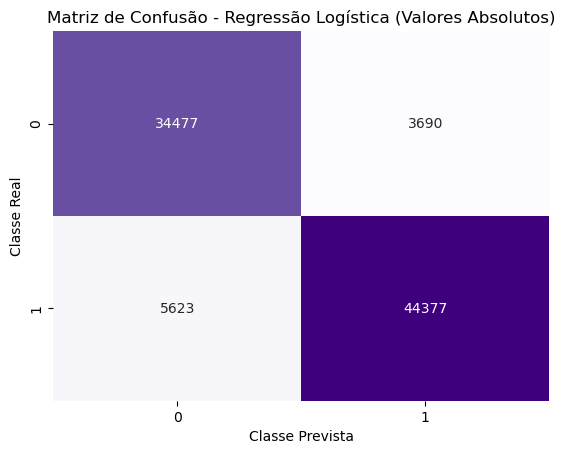
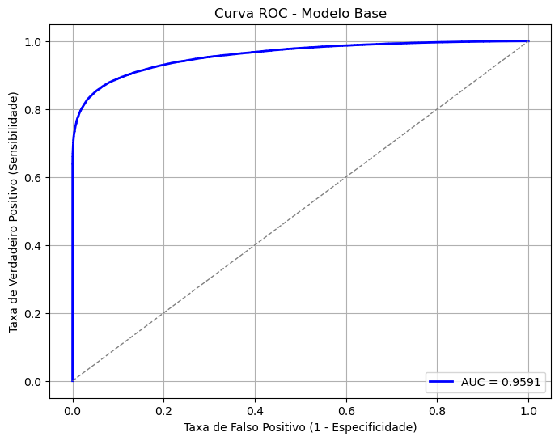
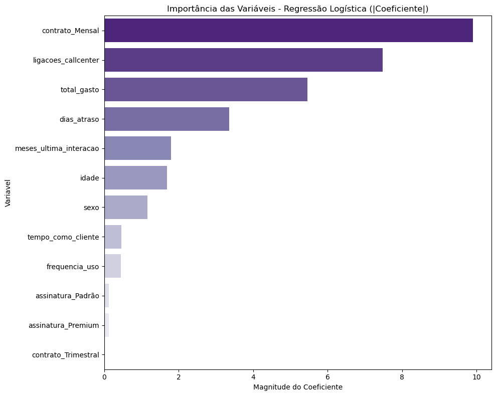
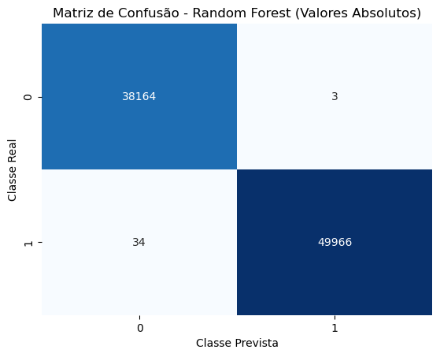
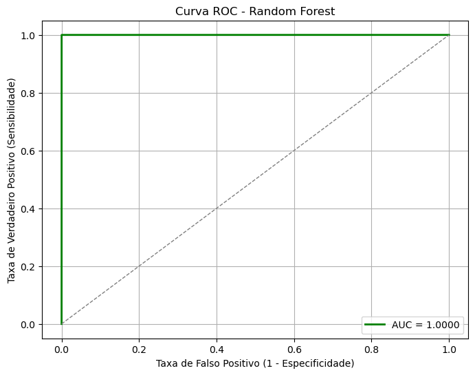
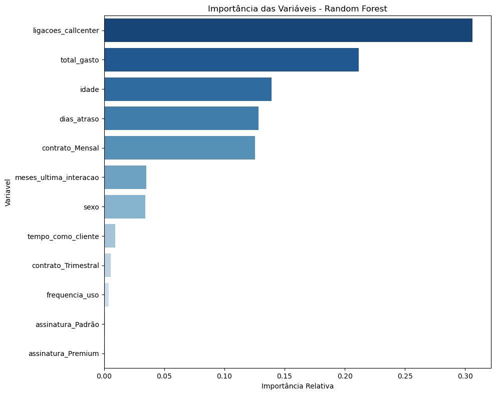
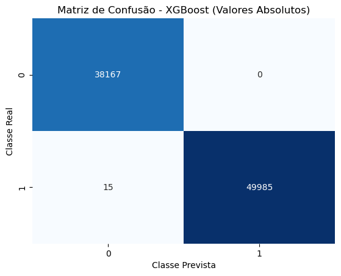
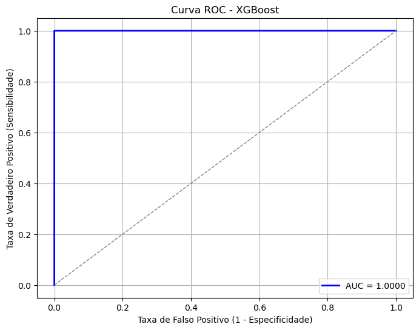
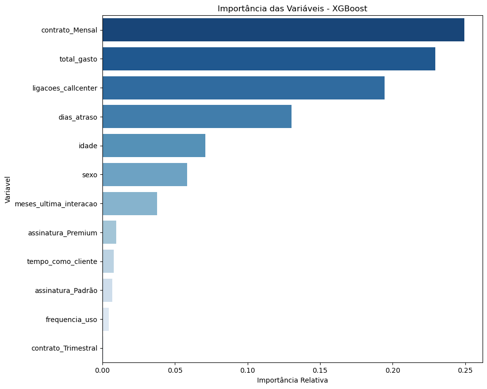

# 📊 Modelagem Preditiva para Identificação de Cancelamento de Clientes (Churn)

Projeto desenvolvido como Trabalho de Conclusão de Curso (TCC) em Ciência da Computação (IFSEMG, 2025), com foco na aplicação de técnicas de Machine Learning para prever cancelamento de clientes.

## 📌 Descrição

Este projeto tem como objetivo desenvolver modelos preditivos capazes de identificar clientes com alta probabilidade de cancelamento (churn), permitindo que empresas adotem estratégias de retenção mais eficientes.

## 🎯 Problema de Negócio

A perda de clientes (churn) impacta diretamente a receita das empresas.  
Antecipar quais clientes têm maior risco de cancelamento permite ações estratégicas como campanhas de retenção e personalização de serviços.

## 📊 Dataset

O dataset contém informações sobre clientes, incluindo variáveis relacionadas ao comportamento, perfil e histórico, utilizadas para treinar modelos de machine learning voltados à previsão de churn.

## 🔄 Pipeline do Projeto

O projeto foi desenvolvido seguindo as etapas abaixo:

1. Pré-processamento dos dados  
2. Análise exploratória (EDA)  
3. Engenharia de atributos  
4. Treinamento dos modelos  
5. Avaliação de desempenho  
6. Comparação entre modelos  

---

## 🔎 Análise Exploratória de Dados (EDA)

Durante a análise exploratória foram investigados padrões, correlações e distribuições das variáveis, auxiliando na compreensão dos dados e na preparação para modelagem.

*(Sugestão: adicionar gráficos futuramente)*

## 🤖 Modelagem

Foram utilizados algoritmos supervisionados para previsão de churn:

### 📌 Regressão Logística

Modelo base utilizado para comparação, com boa interpretabilidade.

**Matriz de Confusão:**

A matriz de confusão mostra que o modelo apresenta boa capacidade de classificação, embora com alguns erros entre as classes, o que é esperado devido à sua simplicidade em capturar relações mais complexas.

**Curva ROC:**

A curva ROC indica uma boa capacidade de separação entre clientes que cancelam e não cancelam, demonstrando que o modelo consegue identificar padrões relevantes, apesar de não alcançar o desempenho dos modelos mais complexos.

**Importância das Variáveis:**

A análise dos coeficientes do modelo permite identificar quais variáveis mais influenciam a probabilidade de cancelamento, oferecendo interpretabilidade e apoio na compreensão dos fatores associados ao churn.

### 🌳 Random Forest

Modelo baseado em múltiplas árvores de decisão, com alta robustez e capacidade de capturar relações não lineares nos dados.

**Matriz de Confusão:**

A matriz de confusão demonstra excelente desempenho do modelo, com alta taxa de acerto e poucos erros de classificação, indicando boa capacidade de identificar corretamente clientes com e sem risco de cancelamento.

**Curva ROC:**

A curva ROC apresenta desempenho próximo ao ideal, evidenciando alta capacidade de separação entre as classes e eficiência na identificação de padrões relacionados ao churn.

**Importância das Variáveis:**

A análise de importância das variáveis mostra quais fatores mais influenciam a previsão do modelo, permitindo identificar os principais drivers de churn e apoiar decisões estratégicas de retenção.

### ⚡ XGBoost

Modelo com melhor desempenho geral no projeto, utilizando técnicas de boosting para otimizar a performance e capturar padrões complexos nos dados.

**Matriz de Confusão:**

A matriz de confusão evidencia excelente desempenho do modelo, com baixíssima taxa de erro e alta precisão na classificação, indicando forte capacidade de identificar corretamente clientes com risco de cancelamento.

**Curva ROC:**

A curva ROC apresenta desempenho próximo ao ideal, demonstrando elevada capacidade de separação entre as classes e eficiência na detecção de clientes propensos ao churn.

**Importância das Variáveis:**

A análise de importância das variáveis evidencia os principais fatores que influenciam o cancelamento de clientes. Esses insights permitem direcionar ações estratégicas mais assertivas, priorizando os principais drivers de churn e aumentando a efetividade de campanhas de retenção.

**Conclusão do Modelo:**

O XGBoost se destacou como o modelo mais eficiente, apresentando melhor desempenho em todas as métricas avaliadas. Sua capacidade de generalização e identificação de padrões complexos o torna a melhor escolha para aplicação em cenários reais de previsão de churn. 

## 📈 Avaliação dos Modelos

Os modelos foram avaliados utilizando as seguintes métricas:

- Acurácia  
- Precisão  
- Recall  
- F1-Score  

## 🏆 Resultados

A tabela abaixo apresenta os resultados obtidos pelos modelos:

| Modelo               | Acurácia | Precisão | Recall | F1-Score | Cancelamentos Previstos |
|----------------------|----------|----------|--------|----------|-------------------------|
| Regressão Logística  | 89,44%   | 92,32%   | 88,75% | 90,50%   | 48.067                  |
| Random Forest        | 99,96%   | 99,99%   | 99,93% | 99,96%   | 49.969                  |
| XGBoost              | 99,98%   | 100,0%   | 99,97% | 99,98%   | 49.985                  |

O modelo **XGBoost** apresentou o melhor desempenho geral, demonstrando maior capacidade de generalização e precisão na identificação de clientes com risco de cancelamento.

## 🚀 Aplicação do Projeto

Este projeto pode ser aplicado em cenários reais para antecipar o cancelamento de clientes, permitindo que empresas atuem de forma proativa na retenção e aumentem a fidelização, reduzindo impactos financeiros.

## 🛠 Tecnologias Utilizadas

- Python  
- Pandas  
- NumPy  
- Scikit-learn  
- XGBoost  
- Matplotlib  
- Seaborn  
- Jupyter Notebook  
